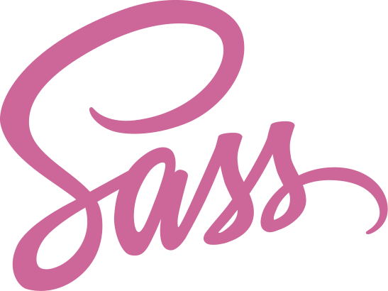
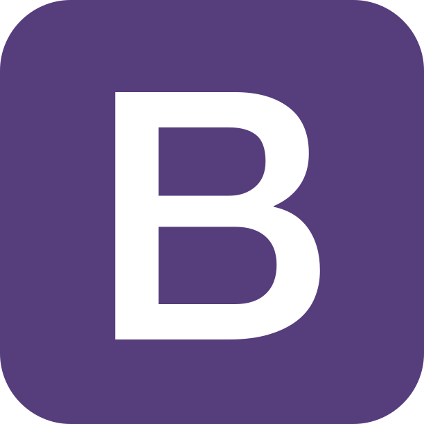
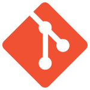
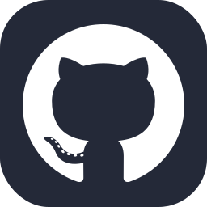

## Hi there 👋 I'm a software developer.

  
<b>My journey</b>

    <h3><em>"You are on your way home without a worry on your mind when you suddenly see a monster lurking along the way. You're in trouble since there is only one road leading home."</em></h3>
    
    
  This is the description to a game called _Monster Road_ that came in the __Casio FX-750p__ personal computer.

  Around 20 years ago, I was starting high school and one of my uncles came to me and said "I have a gift for you". He gave me this thing. A thing of beauty and awe for me. Been like I was, from a small town in The Andes mountains of Venezuela, I had never been in touch with a programable hardware before. I fell in love with the device right away. 

  With its 27KB ROM memory, a 4KB RAM memory card and a one line 24 characters long LCD with no backlight, I felt I could do anything with it. It came with a great manual that it was more like book for learning BASIC programming language. With it I programmed a Yu-Gi-Oh duel points tracker, an average calculator for my high school grades and a program to track the position of La Liga football teams (I'm a huge Real Madrid fan, Hala Madrid!). 

  That was my introduction to programming. From there the passion kind of fade out. I went to college and studied Physics (another of my passions), worked as a teacher and started a family.

  I was able to leave Venezuela with my family in 2021. Then I started my journey to become a Web developer. I am now fulfilling the dream to write code for a living using technologies like HTML, CSS and JavaScript, React, Bootstrap, LESS, SASS and Git/Github.

  If you got this far make sure to contact me. I am always available for new experiences in this wonderful world of technology.

<h2>🧰Skills and technologies:</h2>

<h2>📱 Social Media </h2>

 
 
 

<h2>📈Stats:</h2>

<!--
**khisus19/khisus19** is a ✨ _special_ ✨ repository because its `README.md` (this file) appears on your GitHub profile.

Here are some ideas to get you started:

- 🔭 I’m currently working on ...
- 🌱 I’m currently learning ...
- 👯 I’m looking to collaborate on ...
- 🤔 I’m looking for help with ...
- 💬 Ask me about ...
- 📫 How to reach me: ...
- 😄 Pronouns: ...
- ⚡ Fun fact: ...
-->
